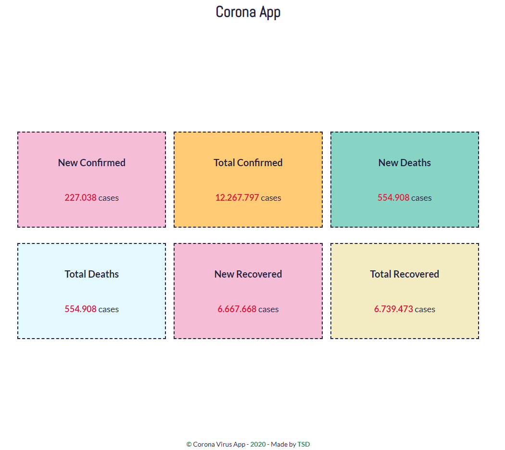

## CoronaVirus App - 2020

---

I’ve used Vanilla JS, fetchApi to retrieve API Data, Sass for styling and BEM for class names.

🚀 I used CSS Grid and made it fully responsive without using media queries.\_\_
🚀 The API updates every 5 minutes and all the items are created dynamically through JavaScript.

